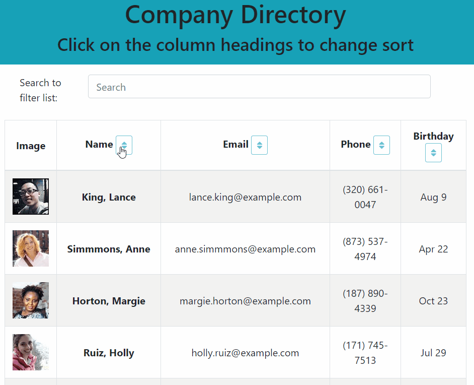

# ReactDirectory
An employee directory built in React, sorts and filters results from Random User API.

[](https://opensource.org/licenses/MIT)

The live app is [available on GitHub Pages](https://ziieng.github.io/ReactDirectory/).

## Table of Contents
* [Description](#Description)
  * [Further Possibilities](#Further-Possibilities)
  * [Built With](#built-with)
* [Installation](#Installation)
* [Usage](#Usage)
* [License](#License)
* [Contributing](#Contributing)
* [Questions](#Questions)

## Description
An employee database built to explore React's handling for changing data.

[](https://ziieng.github.io/ReactDirectory/)

For this project, we pulled data from the [Random User API](https://randomuser.me/), which provides information for fictional users - everything from names and email addresses to profile pictures and passwords. For my own data call, I limited the fields just to the ones I used to save on memory.

The sorting handled by the table of data is performed client-side without making additional calls to the API. Because I also needed to filter data via a search bar, I have the full list of data stored in the app's State and base filtered data off that list each time. This lets me adapt the data to any search the user makes without erasing additional data that didn't fit or needing to make another database call.

### Further Possibilities
It might be nice to have a modal that pops up with more information about a specific employee when their name is clicked, like their job title or office location. 

### Built With

* React
* [React-Bootstrap](https://www.npmjs.com/package/react-bootstrap)
* [Axios](https://www.npmjs.com/package/axios)
* jQuery

## Installation
To install app dependencies, run this command in your terminal:
```
npm i
```

To add the provided seed data, run this command after installation:
```
npm run seed
```

## Usage
Beyond installation, there is no extra setup required to use this app.

## License
This project uses the MIT license. For more details, visit [this link](https://choosealicense.com/licenses/mit/).

## Contributing
Create a fork and send a pull request, or send me an email!

## Questions
If you have questions to ask or issues to report, please visit the [GitHub repository](https://github.com/ziieng/ReactDirectory) for this project, [my GitHub profile](https://github.com/ziieng), or send me an email at cjengelhardt@gmail.com.
